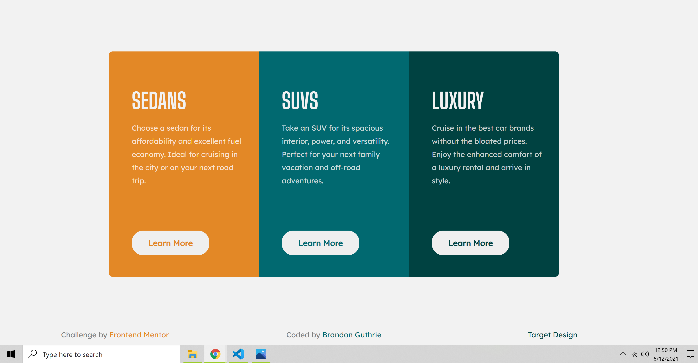

# Hello and welcome!
Hello, my name is Brandon and I am new to web design. I've been studying a course from Udemy on web developement for about a month now.
My methods may not be the best as far as layout choice, postioning, etc but I am open to feedback on my design. The following is my solution 
and a very brief overview of my process and what I learned. Thank you for taking the time to read this!

# Frontend Mentor - 3-column preview card component solution

## Table of contents

- [Overview](#overview)
  - [The challenge](#the-challenge)
  - [Screenshot](#screenshot)
  - [Links](#links)
- [My process](#my-process)
  - [Built with](#built-with)  
  - [Useful resources](#useful-resources)
- [Author](#author)

## Overview

### The challenge

Users should be able to:

# TODO View the optimal layout depending on their device's screen size

- See hover states for interactive elements

### Screenshot

### Links

- Live Site URL: [https://guthribm.github.io/3-column-preview-card-component/](https://guthribm.github.io/3-column-preview-card-component/)

## My process

**Third newbie challenge down and feeling much more confident in my HTML5 and CSS3 abilities. Designed this**
**mobile-first and desktop second. Took some advice from a comment and tweeked my media query techniques and**
**pretty happy with the finished product. Began to learn the difficult lesson of mixing rem, px, and vw/vh**
**can be error prone**

### Built with

- Semantic HTML5 markup
- CSS custom properties
- Flexbox
- Mobile-first workflow
- Chrome Developer Tools
- Visual Studio Code

### Useful resources

- [codepen.io](https://codepen.io/pen/) - **One of the most useful sites I know. You can just jump in and sling some code up to experiment real quick and easily visualize the results**
- [Flexbox Froggy](http://flexboxfroggy.com/) - **Fantastic way to learn flexbox with an interactive game!!**
- [The Markdown Guide](https://www.markdownguide.org/) - **Was very useful when it came to filling this thing out lol**

## Author

- Website - [Brandon Guthrie](https://guthribm.github.io/cv/)
- Frontend Mentor - [@guthribm](https://www.frontendmentor.io/profile/guthribm)
- Email - marlon.brando.calrissian@gmail.com

