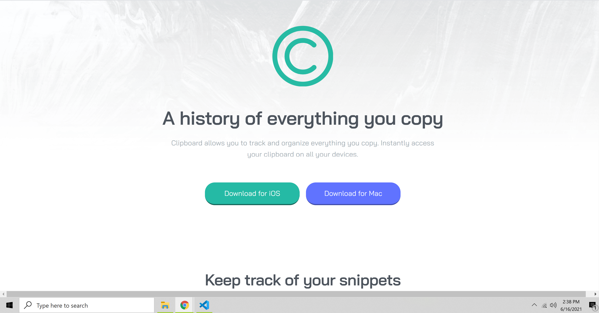

# Hello and Welcome!
**Hello, my name is Brandon and I am new to web design. I've been studying a course from Udemy on web developement for about a month now.**
**My methods may not be the best as far as layout choice, postioning, etc but I am open to feedback on my design. The following is my solution**
**and a very brief overview of my process and what I learned. Thank you for taking the time to read this!**


# Frontend Mentor - Clipboard landing page solution


## Table of contents

- [Overview](#overview)
  - [The challenge](#the-challenge)
  - [Screenshot](#screenshot)
  - [Links](#links)
- [My process](#my-process)
  - [Built with](#built-with)
  - [What I learned](#what-i-learned)  
  - [Useful resources](#useful-resources)
- [Author](#author)


## Overview

### The challenge

Users should be able to:

- View the optimal layout for the site depending on their device's screen size
- See hover states for all interactive elements on the page

**The social media icons were a little tricky for me. I used** 
```css
filter: hue-rotate(0deg) saturate(226) contrast(0.5);
```
**as a hover state change to achieve it.**

### Screenshot




### Links


- Live Site URL: [https://guthribm.github.io/FEM-clipboard-landing-page/](https://guthribm.github.io/FEM-clipboard-landing-page/)

## My process

**So I started mobile version first, I think that is the most comfortable for me. My first tasks were labeling everything with the proper element tags then applied what coloring and font styles that were given. I grouped parts I thought went together into div's and manipulated flexbox for the layout. This was the largest page I've completed so far!**

### Built with

- Visual Studio Code
- HTML5
- CSS custom properties
- Flexbox
- Chrome Developer Tools
- Mobile-first design


### What I learned

Use this section to recap over some of your major learnings while working through this project. Writing these out and providing code samples of areas you want to highlight is a great way to reinforce your own knowledge.

To see how you can add code snippets, see below:


```css
.footer-links img:hover {    
    filter: hue-rotate(0deg) saturate(226) contrast(0.5);
}
```


### Useful resources

- [codepen.io](https://codepen.io/pen/) - **One of the most useful sites I know. You can just jump in and sling some code up to experiment real quick and easily visualize the results**
- [The Markdown Guide](https://www.markdownguide.org/) - **Was very useful when it came to filling this thing out lol**


## Author

- Website - [Brandon Guthrie](https://guthribm.github.io/cv/)
- Frontend Mentor - [@guthribm](https://www.frontendmentor.io/profile/guthribm)
- Email - marlon.brando.calrissian@gmail.com


