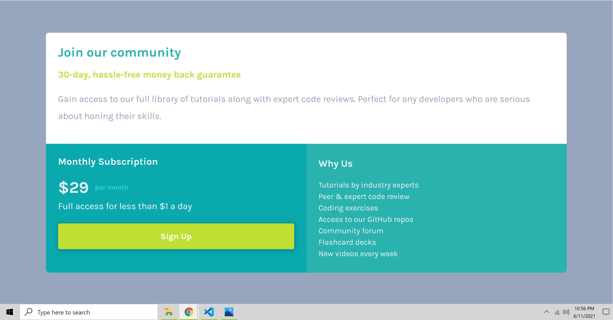

# Hello and Welcome!
**Hello, my name is Brandon and I am new to web design. I've been studying a course from Udemy on web developement for about a month now.**
**My methods may not be the best as far as layout choice, postioning, etc but I am open to feedback on my design. The following is my solution**
**and a very brief overview of my process and what I learned. Thank you for taking the time to read this!**


# Frontend Mentor - Single price grid component solution

## Table of contents

- [Overview](#overview)
  - [The challenge](#the-challenge)
  - [Screenshot](#screenshot)
  - [Links](#links)
- [My process](#my-process)
  - [Built with](#built-with)
  - [What I learned](#what-i-learned) 
- [Author](#author)


**Note: Delete this note and update the table of contents based on what sections you keep.**

## Overview

### The challenge

Users should be able to:

- View the optimal layout for the component depending on their device's screen size
- See a hover state on desktop for the Sign Up call-to-action

**Screen changes for 375px width and above. I decided to go with an alternating colors hover change for the button**

### Screenshot




### Links

- Solution URL: [Add solution URL here](https://your-solution-url.com)
- Live Site URL: [Add live site URL here](https://guthribm.github.io/FEM-single-price-grid/)

## My process

**So unlike the stats preview card challenge, I attemted this one mobile design first and desktop second. It seemed that I was able to complete the challenge**
**MUCH more quickly this time. I used flexbox for the mobile version and grid for the desktop version. The desktop version only required just a handfull of changes.**
**My biggest challenge came with getting familiar with grid and the different templates and layouts**

### Built with

- Visual Studio Code
- HTML5
- CSS custom properties
- Flexbox
- Chrome Developer Tools
- Mobile-first process

### What I learned

**A lengthy impementation for bootstrap-style button**


```css
.middle-card-button {
    color: white;
    width: 100%;
    height: 4rem;
    font-weight: bolder;
    background: hsl(71, 73%, 54%);
    border-radius: 5px;
    border: none;
    align-self: center;
    filter: drop-shadow(1px 2px 6px hsl(189, 86%, 29%));
    font-size: 1.3rem;
    font-family: 'Karla', sans-serif;
}

.middle-card-button:hover {
    background-color: white;
    color: hsl(71, 73%, 54%);
}
```


## Author


- Website - [Brandon Guthrie](https://guthribm.github.io/cv/)
- Frontend Mentor - [@guthribm](https://www.frontendmentor.io/profile/guthribm)
- Email - marlon.brando.calrissian@gmail.com

